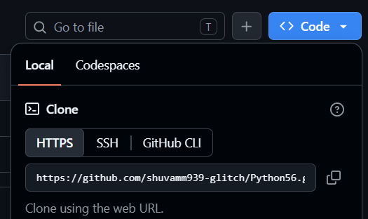
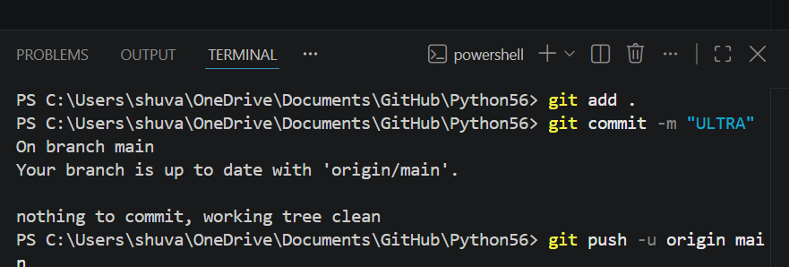
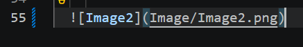
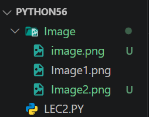

### Git Hub & GIT & Python [USED COMMANDS]+Beggeners Friendly
 *"All commands"*


                
  **ALL COMMANDS["STEP BY STEP]**


  ## Make a repo in ur gitHub Official site
   ```

   GITHUB SITE ("https://github.com/")> LogIN> MakeNewRepo(PrivateRepo)
   ```
  ## CLONE THE REPO IN "VS CODE"     
   ```
   Open vsCode> OpenNewFolder> OpenTerminal(Respectiv)Folder's Terminal IN VSCODE> "USE the command(DOWN)"   

                git pull HTTPSLINK ~ Command
   ```

  
                                    
  ## EITHER U WANT FIND THE PATH OF EXATCT WORKSPACE
   
   Open Terminal in VS Code And Run
   ```
   cd [Tab(Kye)] 
   ```
  ## WRITE & SAVE CODE

   USE KYESHORTCUT
    ```
    Ctrl+S
    ```
  ## ADD THE SAVED CODE IN TERMINAL
   
   OPEN TERMINAL IN VS CODE RUN
     ```
     git add .
     ```
  ## COMMIT THE ADDED CODE IN TERMINAL
     
   RUN THE COMMAND
     ```
     git commit -m "info"
     ```
  ## NOW PUSH THE COMMITED CODE IN GitHub
   
   RUN THE CODE
     ```
     git push -u origin main
     ```
  

  ## ADD IMAGES IN GIT HUB REPO'S LIKE THIS
   
   make a folder named Image then which image u wanna give, pest that image in Image folder then exact pest the formate like given in the Image1 here in README.md file formate given 
    ```
    
    ```
    
  

  

  ## GITHUB BRUNCH CHANGE COMMAND(usuakky use it for work into forks)

     git checkout -b brunchname
  
  ## Python Game Engine(Newly added cheak out the site)

     https://www.ursinaengine.org/index.html

 ## TEST 

